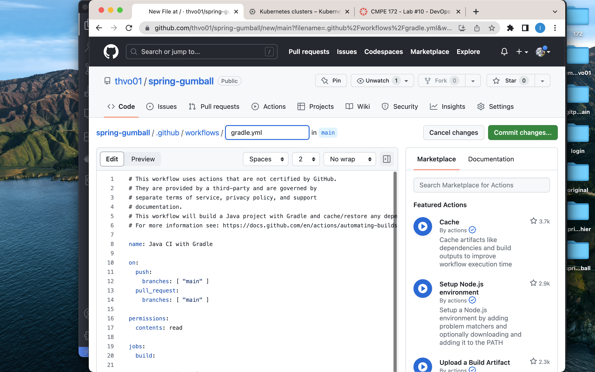
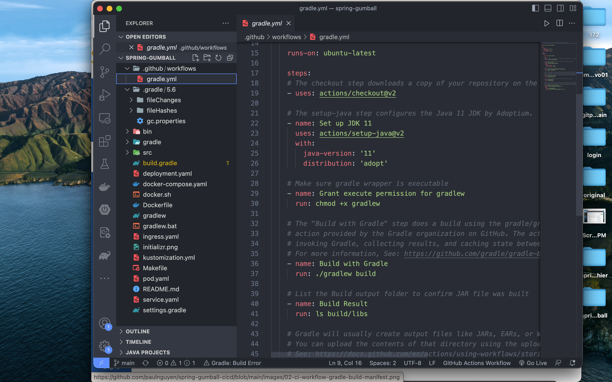
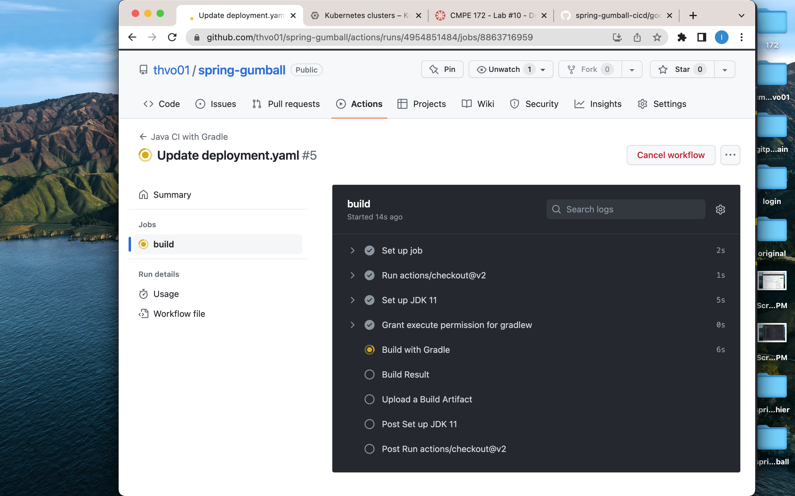
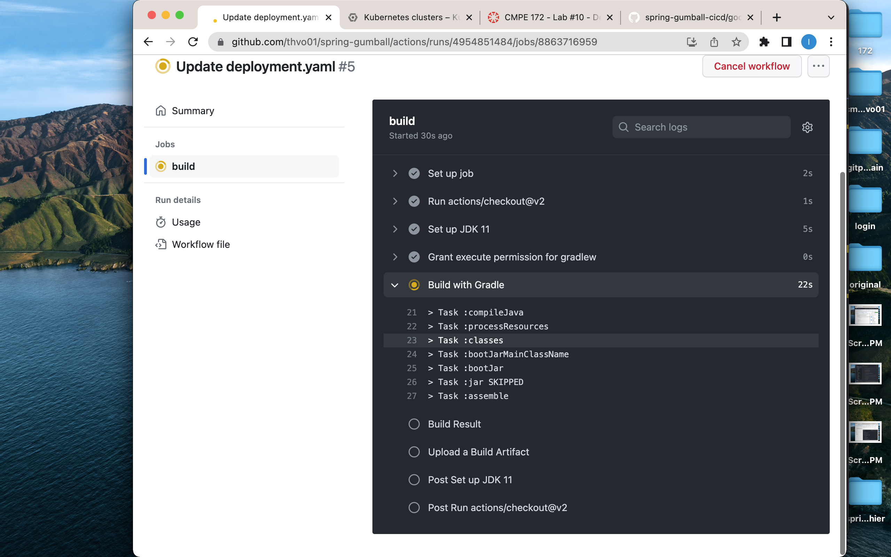
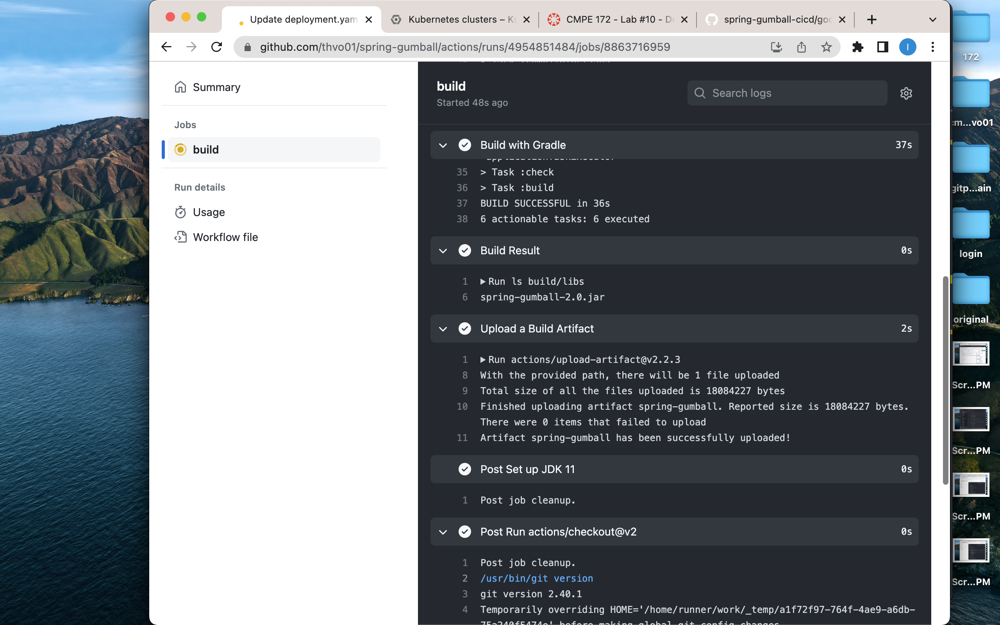
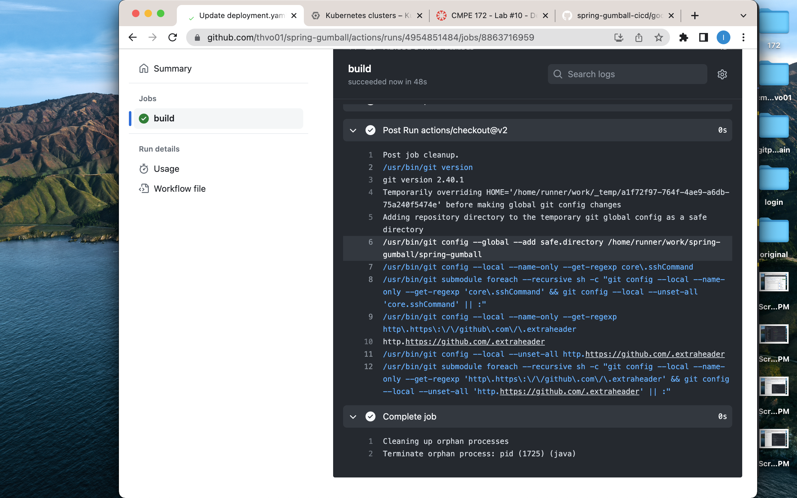

1. 
### Screenshots (in Markdown README.md) for CI Workflow (Part 1)
Preconfigured Gradle starter workflow

Modify gradle.yaml

Make change to the code and commit to main branch to trigger the action

2.
### This criterion is linked to a Learning OutcomeScreenshots (in Markdown README.md) for CD Workflow (Part 2)
